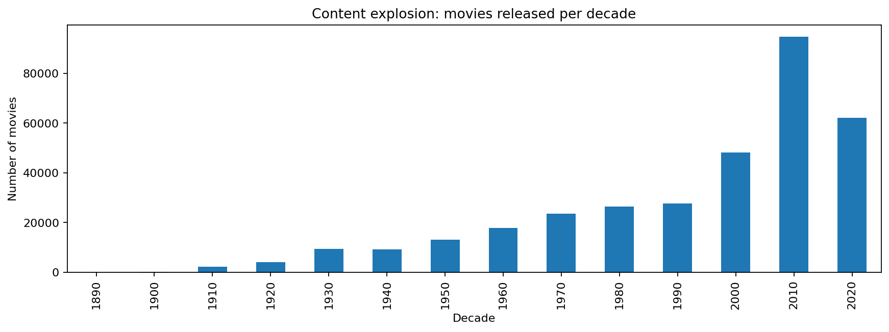
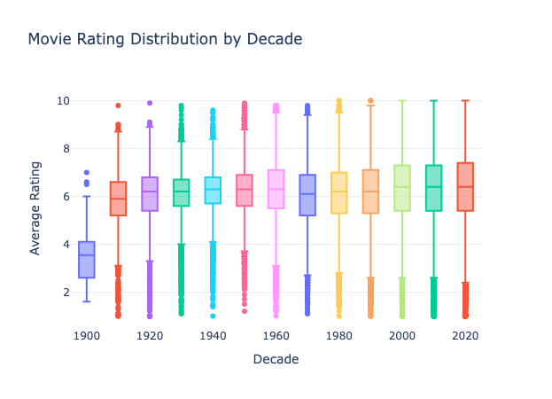
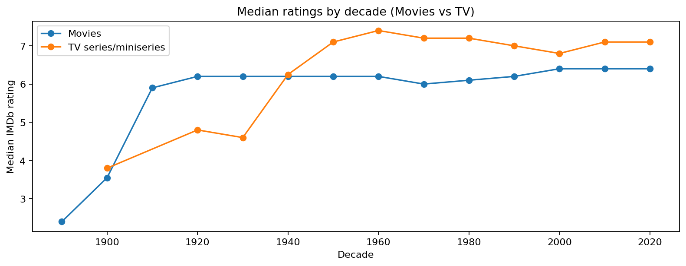

# The Golden Age Myth: A Data-Driven Investigation 🎬

> *"They just don't make them like they used to."*

We've all heard it. The belief that movies and TV shows from the "good old days" were superior to the content churned out today. But is this true, or is it just nostalgia playing tricks on us?

This project uses data science to analyze millions of IMDb ratings and investigate **The Golden Age Myth**. We separate statistical reality from survivorship bias to understand how entertainment quality—and our perception of it—has evolved over the last century.

## � The Dashboard

We have also generated a polished, interactive HTML dashboard to visualize these trends.
*   **Interact**: Open `index.html` in your web browser to explore.
*   **View Online**: [www.praeek.com](http://www.praeek.com)
*   **Optimized Layout**: Clean visualizations with readable titles and axes (no overlap!).
*   **Next Experiments**: Includes a section on future research directions.


## �🕵️‍♂️ Key Findings 

### 1. The "Survivor" Effect 🏆
When we look at movies from the 1940s or 50s, we see a lot of masterpieces. What we *don't* see are the thousands of terrible movies that have been forgotten.
*   **The Data Shows**: Old movies *do* have higher average ratings in the dataset, but largely because the bad ones aren't even being voted on anymore.
*   **Takeaway**: We are comparing the "Best of the Past" against "Everything from Today."

### 2. The Content Explosion 💥
The volume of content has exploded in the streaming era (post-2010).
*   **The Data Shows**: The sheer number of movies and shows released annually has skyrocketed.
*   **Takeaway**: Even if the *percentage* of great movies remains the same, they are now buried under a much larger mountain of average content, making it feel like quality has dropped.

### 3. Popularity vs. Quality 📉
There is often a divergence between what critics love and what everyone watches.
*   **The Data Shows**: Highly-rated specialized content often has fewer votes, while massive blockbusters tend to have average ratings but huge vote counts.

## 🖼️ Visual Reference

Here are some key visualizations from our analysis:

### Content Explosion

*The sheer volume of new content has skyrocketed in recent decades.*

### Rating Trends Over Time

*Distribution of movie ratings showing the variance and trends across decades.*

### Movies vs. TV Trends

*Comparing the median ratings of movies and TV shows over time.*

## 🧪 Next Experiments

If we had one more week, here is what we would investigate next:

*   **Genre-specific analysis**: Has quality changed differently for action vs. drama?
*   **International comparison**: Is this effect global or US-centric?
*   **Critic vs. user ratings**: Do professional reviewers show the same bias?
*   **Temporal analysis**: When exactly did the content explosion begin?
*   **Budget correlation**: Does production cost predict quality across decades?

## 📓 Project Structure

The analysis is broken down into a series of Jupyter Notebooks, designed to be run in order:

*   **`notebooks/01_data_loading.ipynb`**: Loads the massive IMDb datasets.
*   **`notebooks/02_data_cleaning.ipynb`**: Cleans the data (removing duplicates, handling missing values).
*   **`notebooks/03_feature_engineering.ipynb`**: Creates new data points (like "decade" or "vote_weighted_score").
*   **`notebooks/05_survivorship_bias_analysis.ipynb`**: The core investigation into why old movies seem better.
*   **`notebooks/08_content_explosion_ott.ipynb`**: Analyzing the impact of the streaming era.
*   **`notebooks/09_final_story_notebook.ipynb`**: **START HERE for the full narrative!** This notebook synthesizes all findings into a cohesive story.

## 🚀 How to Run It

Want to see the code and charts for yourself?

### Prerequisites
*   Python 3.8 or higher
*   Jupyter Notebook or Lab

### Setup

1.  **Clone or Download** this repository.
2.  **Install Dependencies**:
    Open your terminal or command prompt in the project folder and run:
    ```bash
    pip install -r requirements.txt
    ```
3.  **Explore**:
    Launch Jupyter:
    ```bash
    jupyter notebook
    ```
    Open `notebooks/09_final_story_notebook.ipynb` to read the full report.


---
*Author: Prateek Chandra*
